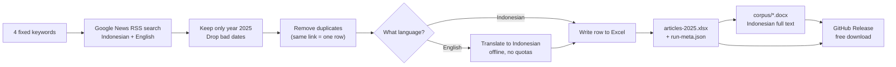

# Microsoft Indonesia 2025 — News Article Scraper

**In plain language:** this project collects news articles about Microsoft in Indonesia published in 2025 and puts them into one Excel file — deduplicated, with English articles translated to Indonesian. It runs whenever you press the button, and every run publishes downloadable files. No coding is needed to get the data.

## Download the Excel (no coding)

1. Open the [Releases page](../../releases).
2. Click the newest release named `articles-2025-*`.
3. Download `articles-2025.xlsx`.
4. Open it in Excel or Google Sheets.
5. Done — see "What's inside the Excel" below to read it.

## When does scraping run?

- **Manually, whenever needed** — repo page → `Actions` → `scrape` → `Run workflow` → `Run workflow`. Each run publishes a new dated Release.
- **Never automatically** — no schedule, and pushing commits or opening pull requests does *not* trigger a scrape. This is deliberate: every run hits Google News and mints a Release, so runs happen on demand, not per commit.

## How it works

In words, one run does this:

1. **Search** — asks Google News for each of the 4 keywords, once in Indonesian and once in English.
2. **Filter by date** — keeps only articles from 1 Jan to 31 Dec 2025. Anything else (including 2026) is dropped and counted in the run log.
3. **Remove duplicates** — the same article often matches several keywords; it is kept once (the other keywords are noted in `Also_Found_In`).
4. **Detect language, translate if needed** — Indonesian articles pass through untouched. English titles and snippets are translated to Indonesian with an offline model, so the run never depends on paid APIs or rate-limited services. Originals are always kept next to translations.
5. **Write the Excel + run log** — one styled `.xlsx` plus a `run-meta.json` recording exactly what happened (counts per keyword, dropped rows, translation stats).
6. **Publish** — the workflow uploads both files and attaches the Excel to a dated GitHub Release.

## Methodology (for papers and theses)

Copy the citable 1-page version from [`docs/methodology-note.md`](docs/methodology-note.md). Summary:

- **Source:** Google News RSS search (`news.google.com/rss/search`), no API keys. Two locales: Indonesian (`hl=id, gl=ID`) and English (`hl=en-US, gl=US`).
- **Keywords (4, exact):** `kerja sama microsoft dengan pemerintah indonesia di tahun 2025` · `investasi microsoft di Indonesia tahun 2025` · `Indonesia central cloud region (2025)` · `Microsoft elevAIte di Indonesia 2025`.
- **Date filter (strict 2025):** only `2025-01-01`–`2025-12-31` kept; unparseable/out-of-range dates dropped and counted.
- **Dedupe rule:** URLs normalized (lowercased host, tracking parameters stripped); first-seen kept, repeats recorded in `Also_Found_In`.
- **Translation rule:** language detected on cleaned text (RSS snippets arrive as HTML link markup, stripped first). English → Indonesian via offline Argos Translate model; originals preserved; Indonesian rows untouched.
- **Reproducibility:** every run writes `run-meta.json` (`run_utc`, counts). Cite the git commit SHA + `run_utc`.

## What's inside the Excel

| Column | Meaning |
|---|---|
| No | Row number |
| Publisher | News outlet (e.g. Kompas.com, CNBC Indonesia) |
| Title_ID | Title in Indonesian (translated if the original was English) |
| Title_Original | Original title as published |
| URL | Link to the article |
| Date | Publication date (`YYYY-MM-DD`, always 2025) |
| Keyword_Found | Which of the 4 keywords found it first |
| Also_Found_In | Other keywords that also matched it |
| Snippet_ID | Short description in Indonesian |
| Snippet_Original | Original short description |
| Source_Lang | Detected language (`id` / `en`) |
| translation_ok | `True` if the Indonesian text is complete |

## Phase 2: docx corpus (for NVivo)

- Build locally: `make corpus` (reads `output/articles-2025.xlsx`, writes `corpus/NNN_publisher_slug.docx` + `failed.csv` + `corpus-meta.json`). Fast check: `make corpus-test LIMIT=5`. Zip for sending: `make corpus-zip`.
- Via CI: Actions → `scrape` → `Run workflow` attaches `corpus-articles-2025.zip` to the same Release as the xlsx.
- Coverage is honest: paywalled/bot-blocked/removed links land in `failed.csv` with reasons — report the ok-rate in your thesis.

## Latest verified corpus

Release [`articles-2025-4`](../../releases/tag/articles-2025-4): **180 rows, 99 publishers**, every row dated 2025, no duplicate links, every row `translation_ok=True` (113 Indonesian, 65 translated from English). Newer releases on the [Releases page](../../releases) supersede these numbers — always cite the release tag you used.

## For developers

- Set up and run: `uv sync && uv run python -m src.scrape` → `output/` (`articles-2025.xlsx` + `run-meta.json`).
- Tests: `uv run pytest -q` (16 tests).
- Re-run in CI: Actions → `scrape` → `Run workflow` (manual only — no schedule).
- Docs map: [`docs/README.md`](docs/README.md). Full plan/design history lives in `docs/completed/`.
